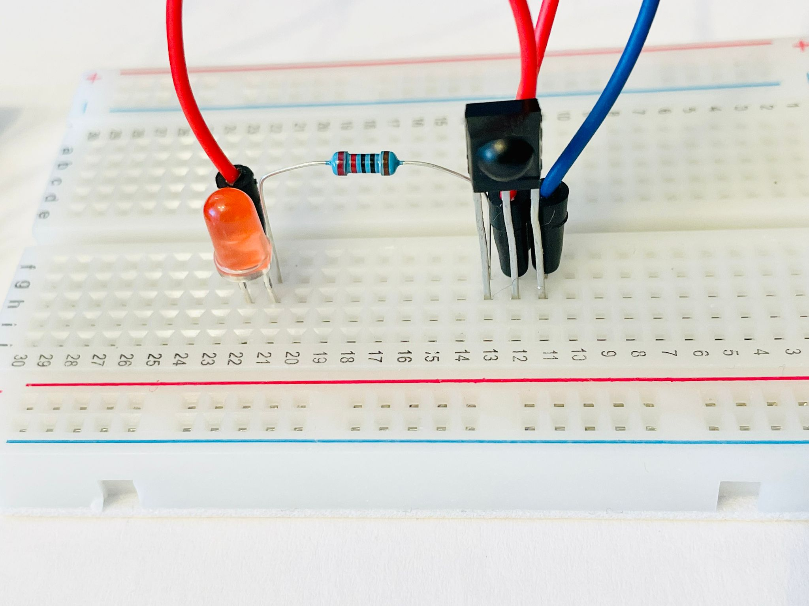
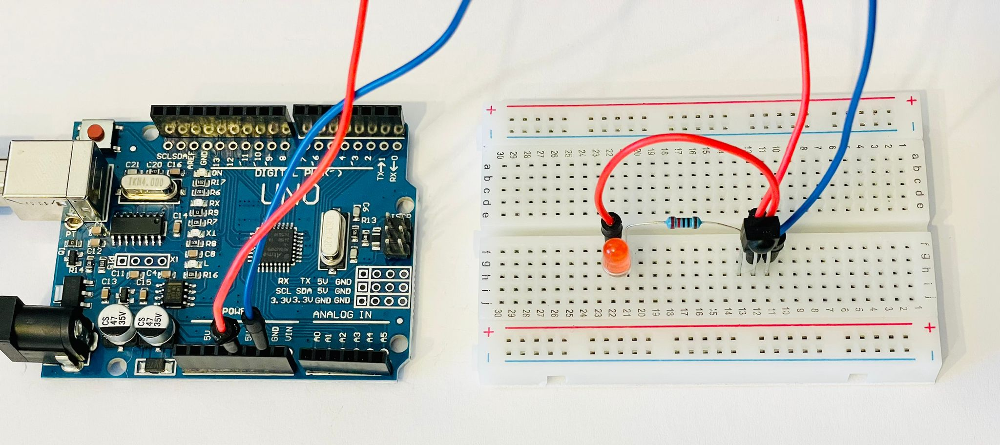
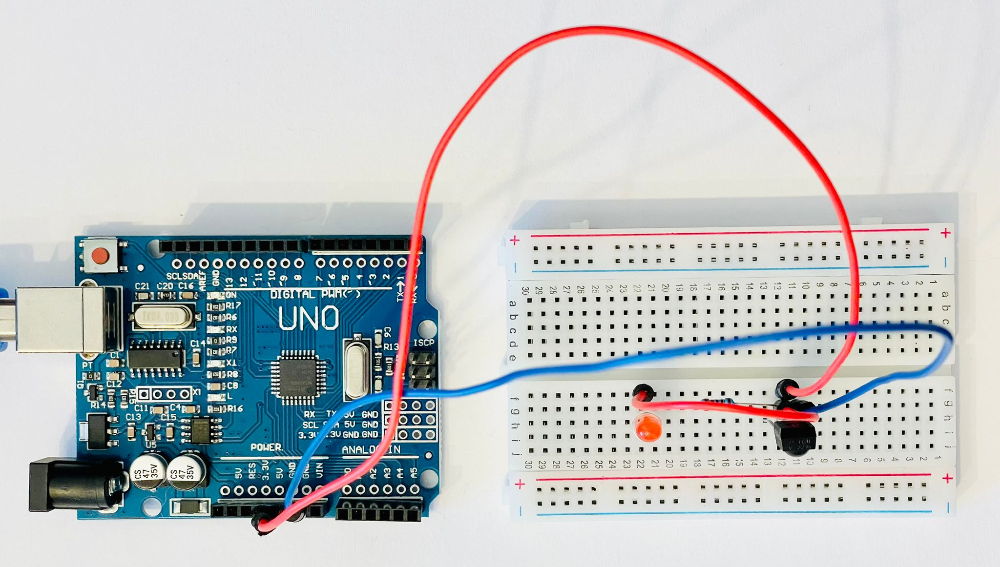

# IR Receiver

## Important notice
Make sure IR receiver pins are correctly connected. 
2 of common receivers datasheets attached: [VS-1838B](vs1838b-datasheet.pdf) and [TSOP-2238](vishay-tsop2238-datasheet.pdf).

## Test ir receiver
### Components

- IR receiver (Out, V, GND)
- led
- 220 ohm resistor
- Breadboard
- 3 dupont wires
- Remote control / IR emitter

### Pinout

- GND from Arduino to GND of IR receiver
- 3.3V / 5V from Arduino to 
  - V pin of IR receiver
  - Longer pin of led
- Out pin of IR receiver to resistor
- Other pin of resistor to shorter pin of led

Use remote to generate IR signals and see led blinking.

## Helpers

https://learn.adafruit.com/ir-sensor/testing-an-ir-sensor