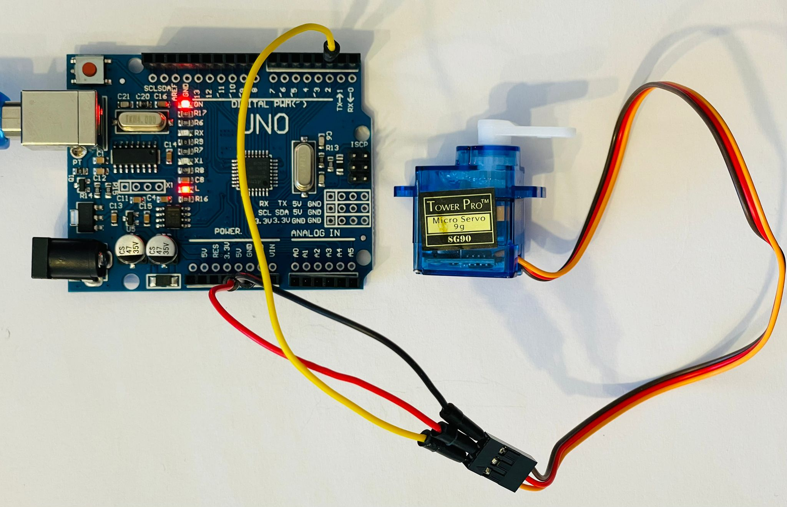

# Arduino Uno - Digitally control servo motor
Components and code

## Components
- Arduino Uno with cable to connect to pc
- Micro Servo motor SG90 9g (180 degrees)
- 3 dupont wires

## Pin connection
- DP-2 - servo signal (left - yellow)
- P-5V - servo power (middle - red)
- P-GND - servo ground (left - brown)

(DP - digital pin / P - power)

## Steps
- Connect components
- Copy servo-digital.ino file
- Select Arduino board and com port
- Upload

## Info
Sketch uses 2130 bytes (6%) of program storage space. Maximum is 32256 bytes.
Global variables use 52 bytes (2%) of dynamic memory, leaving 1996 bytes for local variables. Maximum is 2048 bytes.

## Helpers
- https://www.youtube.com/watch?v=QbgTl6VSA9Y
- https://github.com/arduino-libraries/Servo/tree/master/examples/Knob
- https://www.youtube.com/watch?v=XrEN1oszq_Y
