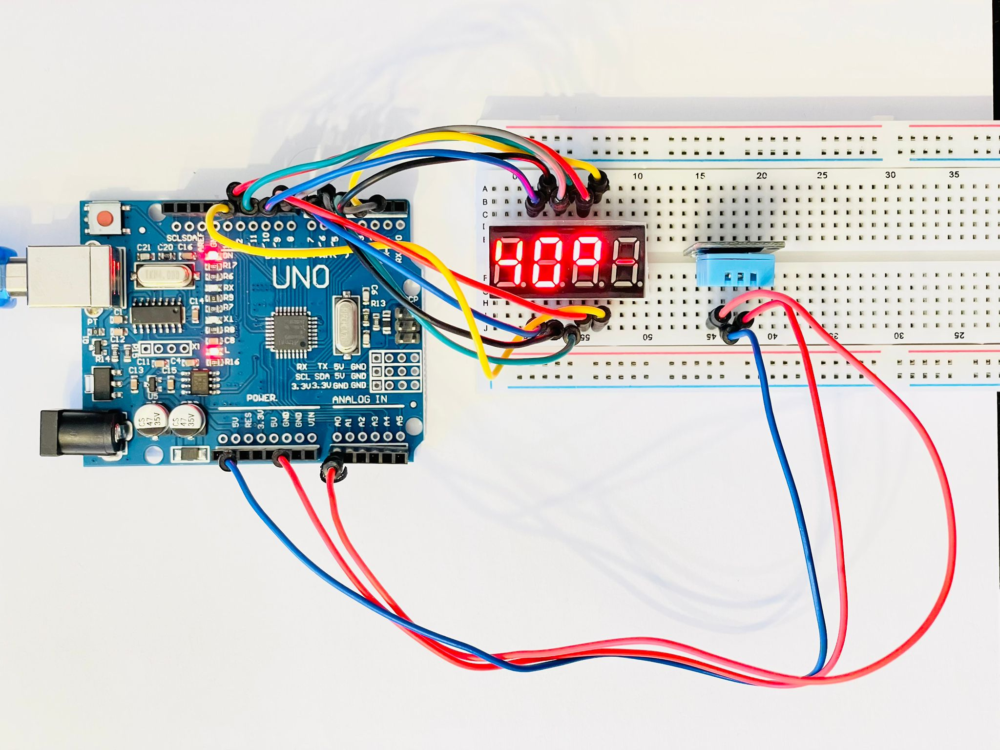
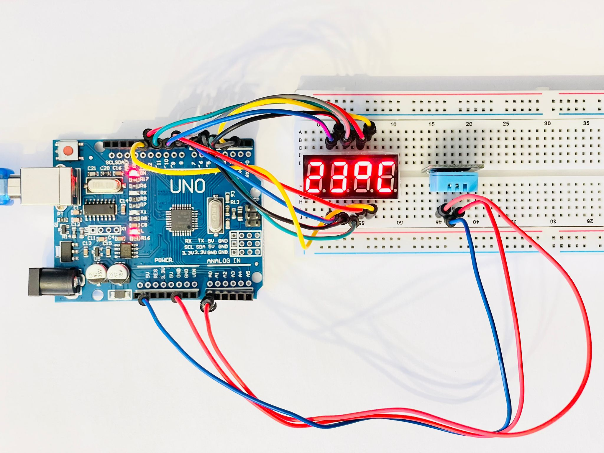
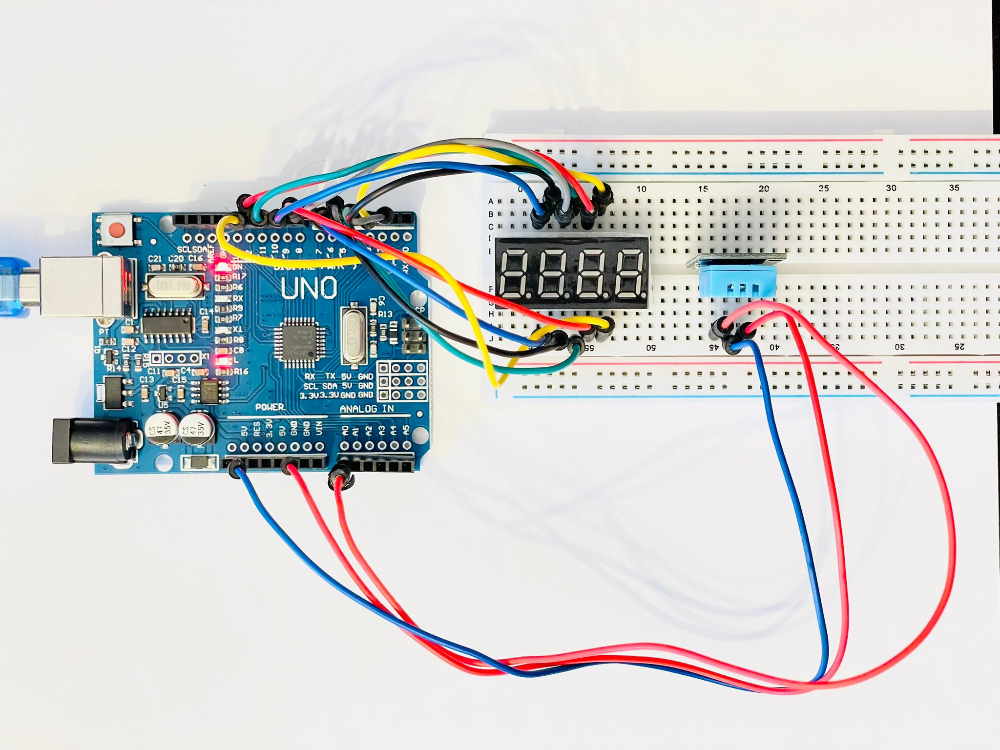
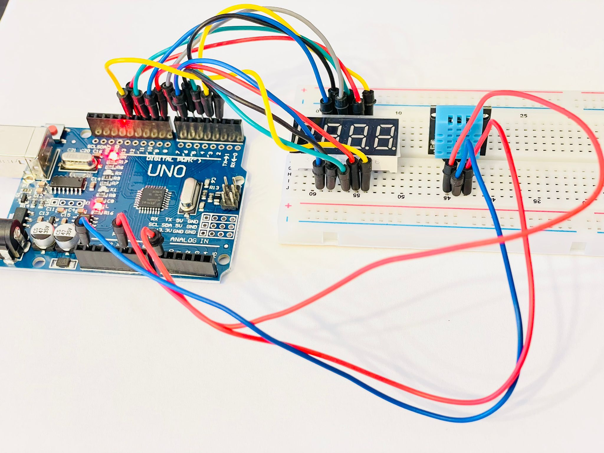

# Arduino Uno - Temperature and Humidity
Components and code

## Components
- Arduino Uno with cable to connect to pc
- 4 digit display - 3461AS (cathode common) [(details)](../components/display-3461AS)
- DHT sensor (DHT11)  [(details)](../components/temp-humidity-sensor-dht11)
- breadboard
- 14 dupont wires

## Pin connection
- DP2 - display pin 11 (segment a)
- DP3 - display pin 7 (segment b)
- DP4 - display pin 4 (segment c)
- DP5 - display pin 2 (segment d)
- DP6 - display pin 1 (segment e)
- DP7 - display pin 10 (segment f)
- DP8 - display pin 5 (segment g)
- DP9 - display pin 12 (D1)
- DP10 - display pin 9 (D2)
- DP11 - display pin 8 (D3)
- DP12 - display pin 6 (D4)
- A0 - dht 11 sensor signal (middle)
- P-5V - dht 11 sensor positive (right)
- P-GND - dht 11 sensor ground (left)

(DP - digital pin / A - analog / P - power)

## Steps
- Connect components
- Install DHT sensor library by Adafruit v1.2.2
- Copy temp-humidity.ino file
- Select Arduino board and com port
- Upload

## Helpers

### Other helpers
- https://www.youtube.com/watch?v=mHpojswQNA0
- https://arduino-projects-free.blogspot.com/2017/04/temperature-humidity-4-digit-7-segment.html
- https://github.com/adafruit/DHT-sensor-library

### Improve write to display speed
https://www.best-microcontroller-projects.com/arduino-digitalwrite.html?utm_content=cmp-true

## Info
Sketch uses 3670 bytes (11%) of program storage space. Maximum is 32256 bytes.
Global variables use 31 bytes (1%) of dynamic memory, leaving 2017 bytes for local variables. Maximum is 2048 bytes.

